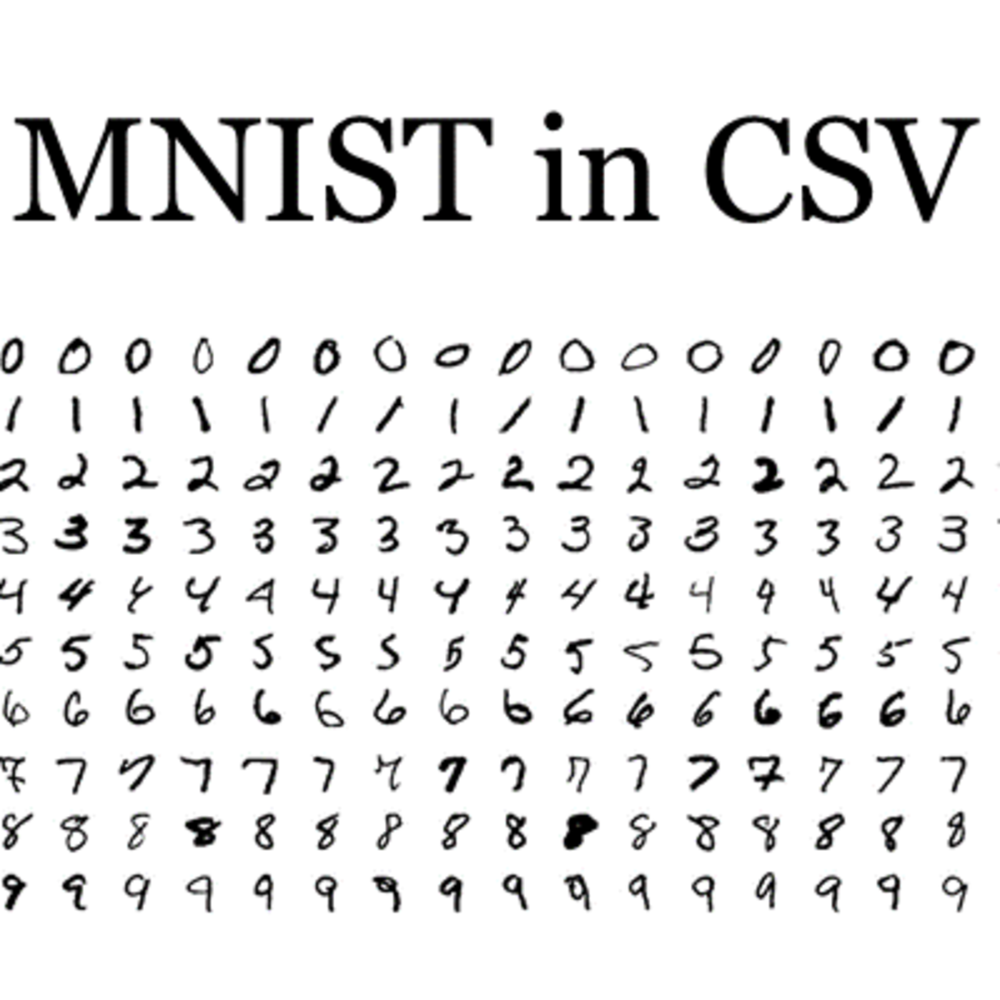

# MNIST_NN

MNIST ("Modified National Institute of Standards and Technology") is the de facto “hello world” dataset of computer vision. Since its release in 1999, this classic dataset of handwritten images has served as the basis for benchmarking classification algorithms. As new machine learning techniques emerge, MNIST remains a reliable resource for researchers and learners alike.

The code for the NN model is written in `nn_model.py`.

The MNIST data is applied using the NN in `NN_MNIST.ipynb`.